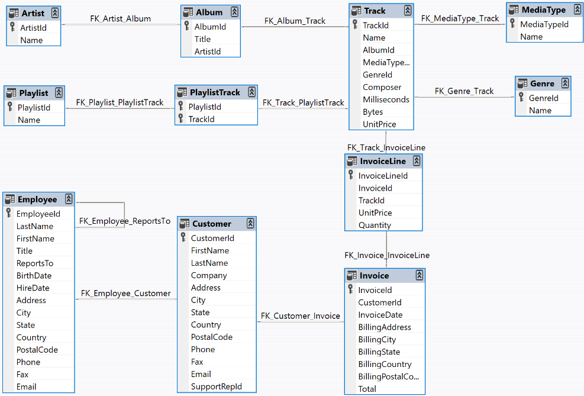

# GenAI-SQL-Queries

## Project Overview

This mini-project is designed to convert simple English questions into SQL queries and retrieve the results from a database (using the Chinook music store database as an example: https://github.com/lerocha/chinook-database).

## 🎯 Key Objectives

* Preprocess data for machine learning
* ...

## Data Model
The Chinook data model represents a digital media store, including tables for artists, albums, media tracks, invoices and customers.


## 📁 Repository Structure
```
GenAI-SQL-Queries/
├── data/
│   └── immovlan_cleaned_file.csv
│
├── models/
│   ├── best_model.pkl
│   ├── encoders.pkl
│   ├── medians.pkl
│   ├── modes.pkl
│   └── scaler.pkl
│
├── notebooks/
│   ├── .ipynb
│   ├── immo-eliza-ml-final-version.ipynb
│   └── immo-eliza-ml-functions.ipynb
│
├── src/
│   ├── train.py
│   └── predict.py
│
├── .gitattributes
├── .gitignore
├── README.md
└── requirements.txt
```
## 🛠️ Technical Implementation
Models Implemented
1. 
2. 
3. 

## Data Pipeline
* 
* 

## 🚀 Installation & Usage
Prerequisites
* Python 3.8+
* Virtual environment recommended

## Setup
'# Clone the repository
git clone https://github.com/yourusername/GenAI-SQL-Queries.git

'# Create and activate virtual environment
python -m venv venv
source venv/bin/activate  

'# Install dependencies
pip install -r requirements.txt

## Running the Project
'# Train models
python train.py

'# Make predictions
python predict.py

## 📈 Results Summary
The project implemented three prediction models with the following key findings:
* XGBoost demonstrated the best overall performance
* Proper preprocessing significantly improved model accuracy
* Feature selection helped reduce overfitting

## 🔮 Future Improvements
* Hyperparameter optimization with GridSearchCV
* Explore more regularization techniques
* Feature engineering for additional predictive power
* Integration in pipeline.

# Package Usage
## Preprocessing pipeline (src/models/trainer.py)
The preprocessing pipeline includes imputation, data scaling (only for Ridge linear model), one-hot encoding, ... The pipelines will also be saved for each model in models/ as models/*_pipeline.pkl.

## Exploratory Data Analyses (notebooks/EDA.ipynb)
Used to visualise and inspect both raw and clean data.

## Training the models (notebooks/experiments.ipynb)
This notebook contains the step-by-step process of training the 3 models: Ridge, RandomForest, and XGBoost. It also has the interpretations of the results, both analytically (??) and in business terms. 

## 📌 Personal context note
This project was done as part of the AI & Data Science Bootcamp at BeCode (Ghent), class of 2025-2026. 
Feel free to reach out or connect with me on [LinkedIn](https://www.linkedin.com/in/aleksei-shashkov-612458308/)!