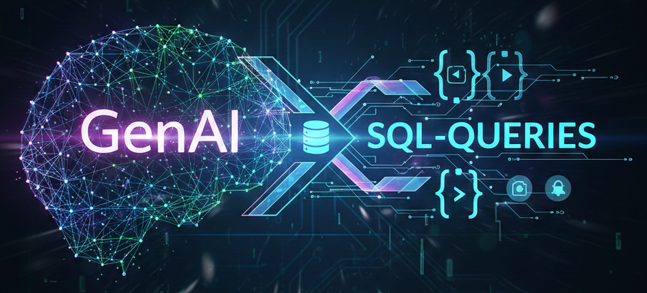

# GenAI-SQL-Queries

## Project Overview

This mini-project is designed to convert simple English questions into SQL queries and retrieve the results from a database (by using the Chinook music store database: https://github.com/lerocha/chinook-database).

## Description
Querying databases typically requires technical knowledge of SQL syntax and schema structures. This project bridges that gap by creating an AI-powered assistant that converts plain English questions into executable SQL queries. Built using Python, LangChain, and SQLite, the system allows non-technical users to "chat" with their data, retrieving real-time results from a predefined dataset (e.g., The Simpsons database) without writing a single line of code.

## Strategic Insights

### **The Value**  
The real power of this assistant is that it makes data accessible to everyone. Usually, if a writer or producer wants to know something from the database, they have to wait for a technical expert to write the code for them. This tool removes that barrier, allowing anyone to ask a question in plain English and get an answer instantly. It essentially turns a complex pile of data into a conversational partner.

### **Why this approach works**:
- **Bridges the Gap**: Connects human curiosity to complex relational storage.
- **Scalability**: Handles large, multi-table JOINs that would be tedious to write manually.
- **Auditability**: Maintains a permanent record of every question and its corresponding SQL result.

## Installation

1. **Clone the project:**

```
    git clone https://github.com/Aleksei-Shashkov/GenAI-SQL-Queries.git
    cd GenAI-SQL-Queries
```
2. **Create virtual environment (Windows)**
```
   python3.13 -m venv .venv
   .\.venv\Scripts\Activate.ps1
   ```

3. **Install dependencies**  
```
    pip install -r requirements.txt
```
4. **Initialize the Database** 

 - Download Data using Terminal - Fetch raw files from Kaggle (Make sure to adapt the code with your generated API key and Kaggle username).

```
    python setup.py
```

- Build SQLite DB (Processes CSVs into simpsons.db)

```
    python build_db.py
```

- Verify Schema (Optional: Check table structures)

```
    python exploring_schema.py
```
5. **Run the SQL Assistant** - Once the database is initialized, launch the interactive query tool:

```
    python main.py
```

## Repo Structure

```
GenAI-SQL-Queries
├── setup.py                 
├── build_db.py              
├── exploring_schema.py      
├── main.py                  
│
├── database_schema.txt      
├── assignment_results.txt   
│
├── requirements.txt         
├── .gitignore               
└── README.md
```

## Process & Methodology

```
┌──────────────┐      ┌────────────────┐      ┌──────────────┐      ┌──────────────┐
│  User Query  │ ──►  │   LLM Engine   │ ──►  │ SQLite Exec  │ ──►  │ Final Result │
│   (English)  │      │  (Text-to-SQL) │      │  (Python)    │      │ (Table/Data) │
└──────────────┘      └────────────────┘      └──────────────┘      └──────────────┘
 "Who is Lisa's        Prompt + Schema        Execute Generated     Visualized Result
   teacher?"              Inference               SQL Query
```
The application follows a modular "Pipeline" approach, where a natural language input is transformed into structured data through four distinct phases.

## Pipeline (LLM)
User question (English)
        ↓
schema.json
        ↓
LLM prompt
        ↓
Generated SQL
        ↓
SQLite execution
        ↓
Results 

### **I. Secure Initialization & Context Loading**  
The system begins by loading environment variables via python-dotenv. A critical design choice was the use of a static schema reference (```database_schema.txt```).

**Why this is important**: Instead of querying the database for its structure every time (which is slow and resource-heavy), the script reads a pre-audited schema file. This provides the LLM with the exact table names and column types it needs to write accurate queries.

### **II. AI SQL Generation (The "Translator")**  
Using the google-genai client, the user's question is wrapped in a high-context prompt.

- **Prompt Engineering**: The prompt combines the content of the schema file with the user’s request, explicitly instructing the model to "Return only SQL".

- **Post-Processing**: Since LLMs often return Markdown formatting (like ```sql blocks), the code includes a cleaning step to strip these characters, ensuring the string is pure SQL ready for execution.

### **III. Database Execution Layer**  
The generated SQL is passed to a robust execution function using sqlite3.

- **Safe Connection Management**: The function uses a try...except...finally block. This ensures that the database connection is closed safely even if the AI generates a faulty query, preventing database locks and memory leaks.

- **Error Handling**: If the SQL is invalid, the system catches the exception and returns a readable error message rather than crashing the program.

### **IV. Data Persistence & Logging**
The final phase focuses on transparency and accountability.

- **User Feedback**: Results are iterated and displayed clearly in the terminal.

- **Audit Trail**: Every interaction is appended to ```assignment_results.txt```. This creates a permanent log of the question asked, the SQL generated by Gemini, and the final data retrieved, which is essential for debugging and evaluating the model's performance over time.

## Dynamic Prompt Engineering
This snippet shows how the assistant gains "context" by reading the schema and instructing the Gemini model:

```python
def generate_sql(user_question):
    """Translating natural language into SQL by injecting the schema into the prompt."""
    schema = get_schema_from_file()

    # Engineering the prompt to enforce a 'SQL-only' output format
    prompt = f"Schema: {schema}\nRequest: {user_question}\nReturn only SQL."
    response = client.models.generate_content(model='gemini-2.5-flash', contents=prompt)
    
    # Sanitizing the response by stripping backticks and markdown formatting
    return response.text.strip().replace("```sql", "").replace("```", "")
```
## Robust SQL Execution

This demonstrates the ability to manage database connections safely and handle potential AI-generated errors.

```python
def run_query(sql):
    """Executing the generated SQL against the SQLite database and fetching raw results."""
    conn = sqlite3.connect('simpsons.db')
    cursor = conn.cursor()
    try:
        cursor.execute(sql)
        rows = cursor.fetchall()
        return rows
    except Exception as e:
        return f"SQL Error: {e}"
    finally:
        # Ensuring the database connection is closed safely
        conn.close()
```

##  Automated Audit Logging
This implementation facilitates AI performance monitoring by archiving the complete "Question $\rightarrow$ SQL $\rightarrow$ Result" lifecycle. By capturing the raw SQL alongside the user’s intent, the system ensures transparency and provides a dataset for future prompt optimization.

```python
# Appending the interaction to a log file for history tracking    
    with open("assignment_results.txt", "a", encoding="utf-8") as f:
        f.write(f"Q: {question}\nSQL: {sql}\nResult: {results}\n\n")
```
*E*.*g*. Output:
```
Q:Which player gain the most points?
SQL: SELECT Player FROM nhl ORDER BY PTS DESC LIMIT 1
Result: [{'Player': 'Joe Thornton\\thornjo01'}]

Q:How many goals has Ovechkin?
SQL: SELECT SUM(G) FROM nhl_2004_2018_player_data WHERE Player LIKE '%Ovechkin%'
Result: [{'SUM(G)': 653}]

Q:TOP-5 players with the most points in all seasons?
SQL: SELECT Player, SUM(PTS) AS total_points FROM nhl GROUP BY Player ORDER BY total_points DESC LIMIT 5
Result: [{'Player': 'Sidney Crosby\\crosbsi01', 'total_points': 1176}, {'Player': 'Joe Thornton\\thornjo01', 'total_points': 1173}, {'Player': 'Alex Ovechkin\\ovechal01', 'total_points': 1153}, {'Player': 'Henrik Sedin\\sedinhe01', 'total_points': 1013}, {'Player': 'Daniel Sedin\\sedinda01', 'total_points': 989}]

Q:The most rude player?
SQL: SELECT Player FROM nhl_2004_2018_player_data ORDER BY PIM DESC LIMIT 1
Result: [{'Player': 'Daniel Carcillo\\carcida01'}]

Q:How many penelty minutes has  the most rude player?
SQL: SELECT PIM FROM nhl ORDER BY PIM DESC LIMIT 1
Result: [{'PIM': 324}]
...


## **The Result:**  
By combining the Google Gemini 2.5 Flash model with a local SQLite database, I transformed a complex relational dataset into an accessible conversational interface. Users can now retrieve specific insights from the Simpsons universe (**or a database of your choice**) without knowing any SQL syntax.

- **Natural Language Processing**: The assistant accurately interprets intent and maps it to the specific schema of the Simpsons dataset.

- **Automated Audit Trail**: Every interaction is captured in ```assignment_results.txt```, creating a comprehensive record that includes the user's question, the AI-generated SQL, and the final data output for validation.


## **Future Improvements:**  

- *Query Refinement Loop*: Implement a "self-healing" mechanism where the assistant tries to fix its own SQL if the initial execution returns a sqlite3 error.

- *Interactive UI*: Migration from a terminal-based input to a Streamlit or Gradio web interface for a more user-friendly experience.

- *Advanced Visualization*: Integrate matplotlib or seaborn to automatically generate charts (e.g., "Most frequent characters by season") when the query returns numerical data.

## **Timeline**
This solo project was completed over 2 days.

## 📌 Personal context note
This project was done as part of the AI & Data Science Bootcamp at BeCode (Ghent), class of 2025-2026. 
Feel free to reach out or connect with me on [LinkedIn](https://www.linkedin.com/in/aleksei-shashkov-612458308/)!